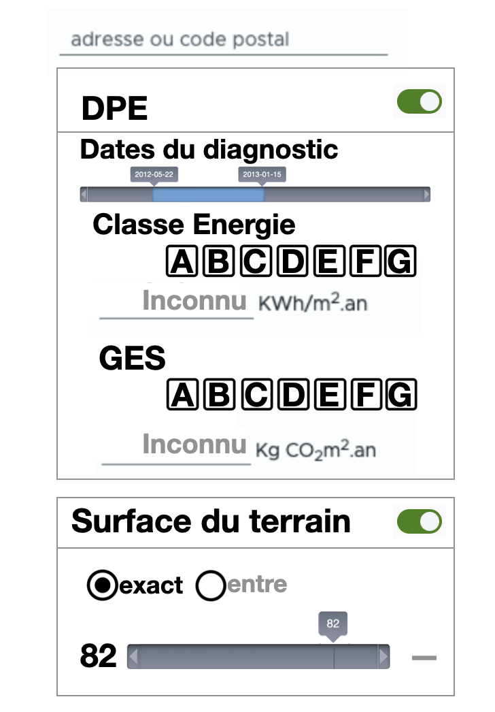
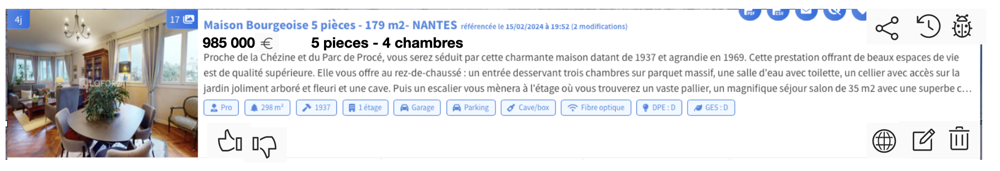

## TODO
1. Améliorer l'interface
   
 
 
3. Avec une version compactée 
	- dans des card de Clarity
	- Les lettres sont activables

4. Développer un code d'analyse d'une page html pour détecter automatiquement le DPE et surface. Pour cela utiliser une bilbiothèque d'analyse de code html sur le serveur :
	- par exemple : Beautiful Soup
	- On inscrit l'URL et le système analyse l'annonce pour trouver les valeurs.

	site visé : leboncoin

5. Développer un compte client.
	- une page de login 
		(avec inscription)
	- sauvegarder les annonces trouvées.

